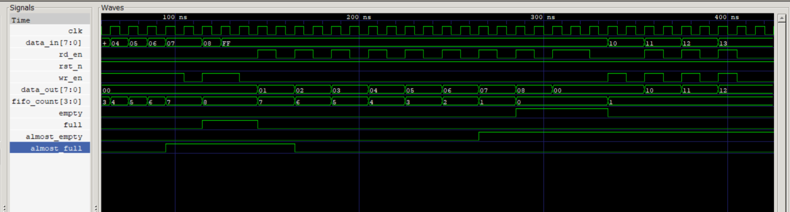

# Synchronous FIFO in Verilog 🚀

This project implements a **parameterized synchronous FIFO** buffer in Verilog, supporting:

- `full` / `empty` flags
- `almost_full` / `almost_empty` early-warning flags
- `fifo_count` tracking
- Underflow and overflow protection
- Simultaneous read/write support
- Fully annotated **testbench**
- GTKWave simulation and waveform analysis

---

## 🔧 Features

- **Configurable Parameters:**
  - `DATA_WIDTH`: width of each FIFO entry (default: 8 bits)
  - `FIFO_DEPTH`: total number of FIFO entries (default: 8)

- **Functional Highlights:**
  - Separate `wr_ptr` and `rd_ptr` management
  - Synchronous read/write logic
  - Smart handling of corner cases like overflow & underflow
  - Flags for **early warning** before full or empty states

---

## 🧪 Testbench Coverage

Testbench verifies the following:

- ✅ FIFO Reset behavior
- ✅ Write up to `almost_full`
- ✅ Write beyond `full` (Overflow prevention)
- ✅ Read up to `almost_empty`
- ✅ Read beyond `empty` (Underflow prevention)
- ✅ Simultaneous Read and Write
- ✅ Flag behavior (`full`, `empty`, `almost_full`, `almost_empty`)
- ✅ Count tracking (`fifo_count`)

---

## 📈 Waveform

Simulation was done using `GTKWave`. Below is a snapshot:



---

## 🚀 Run the Simulation

```bash
iverilog -o test.vvp fifo_design.v testbench_fifo.v
vvp test.vvp
gtkwave fifo_tb.vcd
